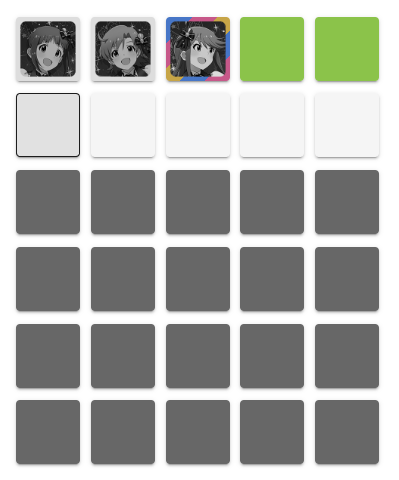
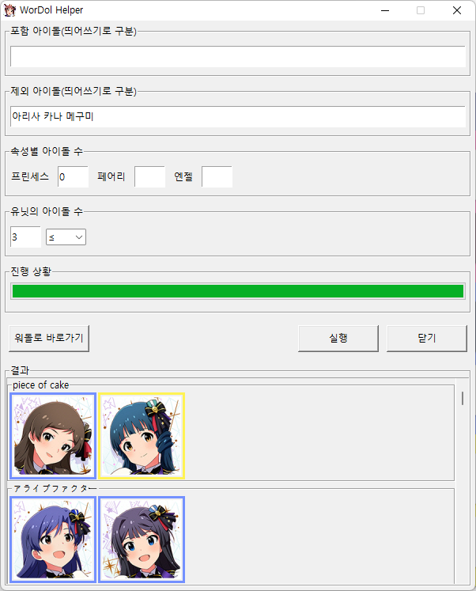
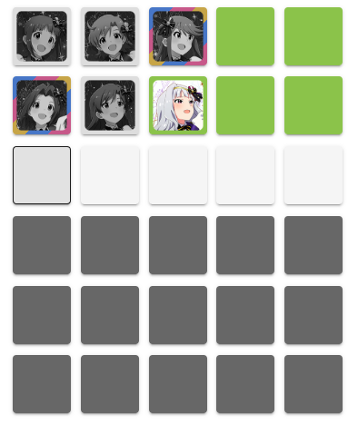
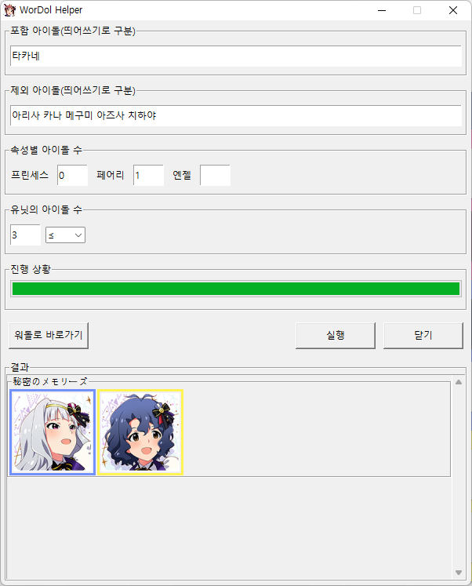

# WorDOL Helper

MLTD - WorDOL Helper

[워돌 바로가기](https://app.39m.ltd/games/wordol/)


## 사용법

1. 워돌에서 임의의 유닛을 입력한다.


2. 워돌 결과를 보고 정보를 파악한다.

   

   - 프린세스 속성의 아이돌은 없다.
   - 아리사, 카나, 메구미를 유닛에서 제외한다.
   - 3인 이하의 유닛이다.
   - 페어리가 최소 한 명이다.

3. 파악한 정보를 워돌 헬퍼에 입력한다.

   

   - **포함 아이돌**: 없음
   - **제외할 아이돌**: 아리사 카나 메구미 (띄어쓰기로 구분, 이름만 입력)
   - **속성별 아이돌 수**: 프린세스=0 (페어리는 최소 1명이므로 패스)
   - **유닛의 아이돌 수**: 3, ≤(이하)

4. 결과창 리스트에서 유닛을 선정하고 워돌에 입력한다. (반복)

   

   - 타카네 포함
   - 아즈사 치하야 제외
   - 페어리 1명

   

   - 정답 확인

   


## 커스텀

- `WorDOL Helper.exe`와 함께 동봉된 `unit_list.json` 파일에서 유닛을 바꿀 수 있다. (메모장이나 Notepad++ 등 프로그램 이용)

  ```json
  {"유닛":{
      "유닛명1":["아이돌1", "아이돌2", "..."],
      "유닛명2":["아이돌a", "아이돌b", "..."],
      ...
  	}
  }
  ```

  

- `images` 폴더에서 아이돌 이미지를 바꿀 수 있다. 

  - 100x100 해상도의 `아이돌명.jpg` 파일

